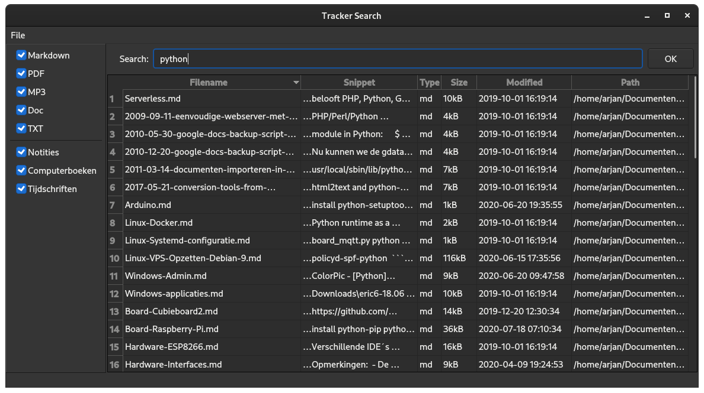
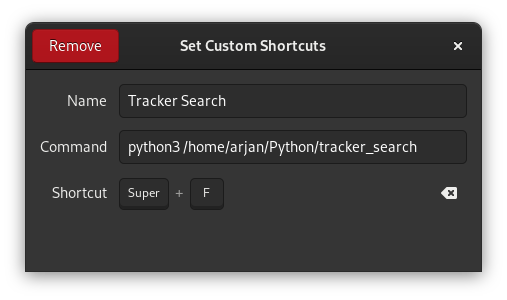

# Tracker Search

[Tracker Search](https://github.com/wooni005/tracker_search) is a full text search Qt application. The [Gnome Tracker](https://wiki.gnome.org/Projects/Tracker) is a file system indexer which currently shipped with [Gnome 3](https://www.gnome.org/gnome-3/). The Gnome Tracker is used by Nautilus, but none of the Gnome tools is able to perform a full text search in the index. But that's exactly what [Tracker Search](https://github.com/wooni005/tracker_search) is able to.

 

## Usage

To use Tracker Search is simple. Just enter your search term into the Search field and click the OK button or enter. After that you can filter your results by unmark one of the options in the left sidebar. The sidebar contains file extensions (Type column) and directories/search areas (Path column).

In the search expression it's possible to use:

* Booleans: AND, OR

* Parenthesis: ()

* Asterisks: *

* etc



### Keyboard shortcuts

* Ctrl-X: exit

* Ctrl-E: set focus to search box

## Installation

The Tracker Search tool is multi-platform and runs on every system where Gnome Tracker is running. Check if Gnome Tracker is available on your system:

```bash
$ tracker daemon
Store:
29 Jul 2020, 22:33:04:  ✗     Store                   - Unavailable

Miners:
29 Jul 2020, 22:33:04:  ✗     RSS/ATOM Feeds          - Not running or is a disabled plugin
29 Jul 2020, 22:33:04:  ✓     File System             - Idle 
29 Jul 2020, 22:33:04:  ✗     Extractor               - Not running or is a disabled plugin
```

To run Tracker Search we need Python 3 and PySide2 (Qt), to install PySide2, do the following:

```bash
$ pip install PySide2
```

To install Tracker Search, you can do the following instructions, or install it in another directory:

```bash
$ cd
$ mkdir Python
$ cd Python
$ git clone https://github.com/wooni005/tracker_search.git
```

**Set a custom keyboard shortcut in Gnome**

Start Settings and select "Keyboard Shortcuts", click on the "+" button at the bottom and fill in the following settings to start Tracker Search with the Super-F key.
Replace "/home/arjan" with your own user path.



## Configuration

The `settings.conf` file is located in `~/.config/tracker_search` and will be generated when the application starts for the first time.

These are the default setting. The `[General]` section contains the latest position and size of the window. This will be automatically updated.

The `[documentTypes]` section contains all extensions for filtering the results.
The `[searchAreas]` section contains all paths for filtering the results

Keep in mind that if you remove or add something to these sections, you need to adapt the size also.

```ini
[General]
pos=@Point(0 0)
size=@Size(1920 1043)

[documentTypes]
1\name=Markdown
1\type=md
2\name=PDF
2\type=pdf
3\name=MP3
3\type=mp3
4\name=Doc
4\type=docs
5\name=TXT
5\type=txt
size=5

[searchAreas]
1\name=Notities
1\path=/home/arjan/Documenten/Gitea/Notities/Notities
2\name=Computerboeken
2\path=/home/arjan/Nas/Boeken/Computer
3\name=Tijdschriften
3\path=/home/arjan/Nas/Tijdschriften
size=3
```

## Directories / searchAreas

Gnome Tracker is used normally only on the local file system. But it is also possible to index network drives. In my configuration I've the /Nas directory mounted with cifs to my Synology NAS and is Gnome Tracker able to index directories from the NAS. See the next paragraph "Tracker internals" how to add the /Nas directory

# Gnome Tracker internals

It is possible to change detailed settings of Tracker with the **dconf-editor** in **/org/freedesktop/tracker/miner/files**:

* **crawling-interval** -> **0** force to activate the crawler right now. But after crawling it needs to set back to the default -1

* Possible to change the directories, which needs to be indexed: **index-recursive-directories**, for example: 
  ['&DESKTOP', '/home/arjan/Documenten/Gitea/Notities/Notities/', '&MUSIC', '&PICTURES', '&VIDEOS', '/home/arjan/Nas/Tijdschriften']

* In **Nautilus->Preferences->Search & Preview**->**Search**: **All locations**

Status of the tracker can be seen with:

```bash
$ tracker daemon
Store:
29 Jul 2020, 22:33:04:  ✗     Store                   - Unavailable

Miners:
29 Jul 2020, 22:33:04:  ✗     RSS/ATOM Feeds          - Not running or is a disabled plugin
29 Jul 2020, 22:33:04:  ✓     File System             - Idle 
29 Jul 2020, 22:33:04:  ✗     Extractor               - Not running or is a disabled plugin
```

Also possible to re-index all data with a hard reset of the index:

```bash
$ tracker reset --hard
g_io_module_get_default: Found default implementation dconf (DConfSettingsBackend) for ‘gsettings-backend’
Setting database locations
Checking database directories exist
Checking database version
Checking whether database files exist
Removing all database/storage files
  Removing database:'/home/arjan/.cache/tracker/meta.db'
  Removing db-locale file:'/home/arjan/.cache/tracker/db-locale.txt'
  Removing journal:'/home/arjan/.local/share/tracker/data/tracker-store.journal'
  Removing db-version file:'/home/arjan/.cache/tracker/db-version.txt'
```

Start the tracker daemon with:

```bash
$ tracker daemon -s
```

Test how to search the index:

```bash
$ tracker search -fs linux
```

Tracker-fs indexer manual restart:

```bash
# Stop the tracker daemon
$ tracker daemon -t
# Start the indexer with debug info
$ /usr/libexec/tracker-miner-fs -v 3
```

Info: [Projects/Tracker/Documentation/Debugging - GNOME Wiki!](https://wiki.gnome.org/Projects/Tracker/Documentation/Debugging)